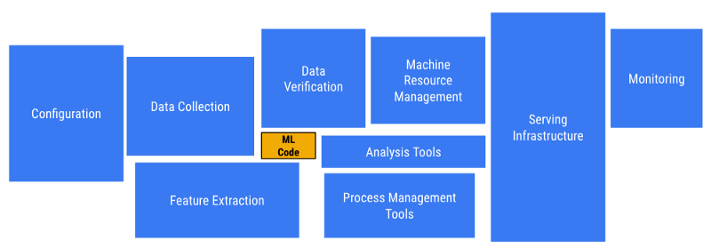
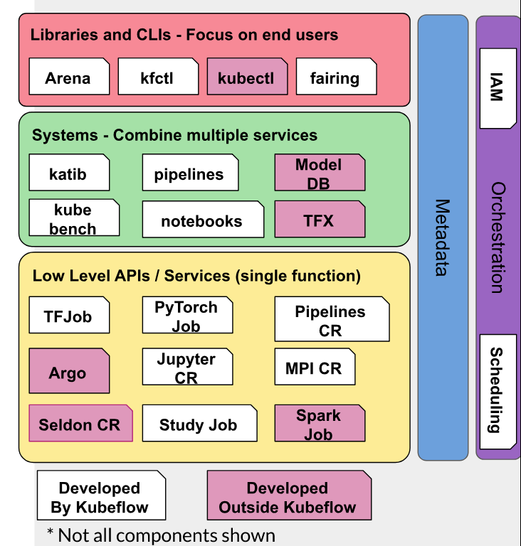
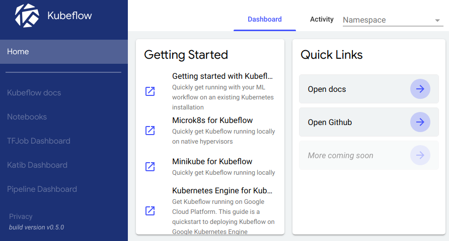
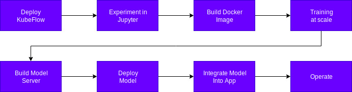
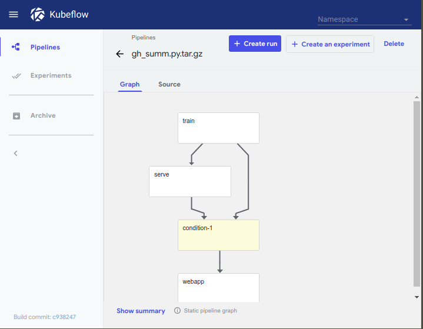
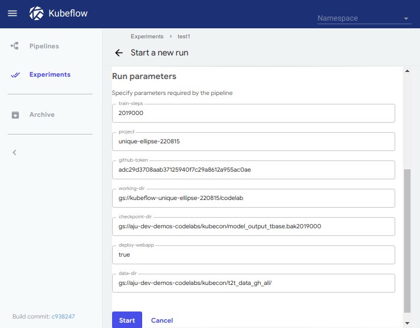
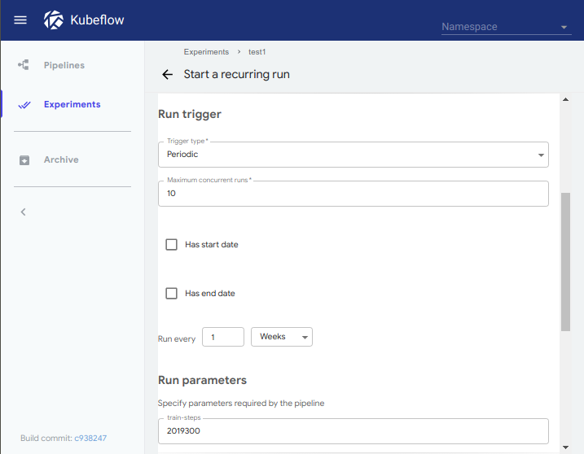
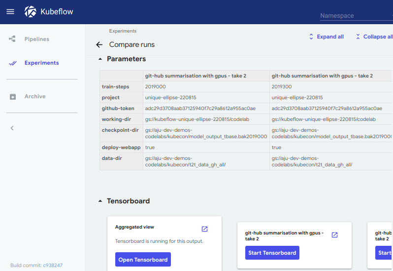

 

## Introduction

Machine Learning is ubiquitous these days and deploying and managing the machine learning software is challenging. 
There is a platform which solves some of the challenges. Yes, you guessed it right. It's KubeFlow.
KubeFlow is an open source project started by Google in 2017.
KubeFlow is a set of tools which make it easy to develop, test, deploy and serve scalable and portable machine learning models in different environments.
KubeFlow is more like a platform where ML Engineers/Data Scientists/(...) and DevOps can collaborate and solve the production scale machine learning problems. 
It enables easy handling of the cloud for ML Engineers/Data Scientists/(...) and easy handling of ML models for DevOps.

KubeFlow aims to achieve the following goals with the help of other tools: [5]

- Cloud Native Machine Learning
- Sharing, re-use, and composability 
- Rapid and reliable experimentation 

We will explain each one of them during the following sections.

## Why KubeFlow
According to [1], there is a common misconception that the ML task is largely consisted of building the model and rest of the stuff such as deploying, maintaining and monitoring the model take a trivial amount of time. 
But in reality, the machine learning tasks contain a lot of hidden technical debt which is often ignored. 
The following image shows the reality:

 

Normally, the task of a data scientist consists of many tasks ranging from:

Data validation, model training, testing, improving, etc. on a local machine, test server and on a production server. 
There are a lot of common steps that are performed in each environment and several issues arise while moving the stack from one environment to the other.
This redundancy of steps and issues increase the technical dept of an ML task.

KubeFlow solves the issues of environments by using Kubernetes as the environment and it solves the issue of repetition with the help of pipelines.
When the infrastructure becomes cloud native, following features come for free:

- Auto-scaling of CPU, GPU, Accelerators
- Cost-effectiveness
- Effective resource utilization

## Architecture
KubeFlow is more like a platform which provides a number of different tools for creating production scale Machine Learning Solutions.
Here is a tentative architecture by Jeremy Lewi from Google which he presented in one of his [talks](https://docs.google.com/presentation/d/1kJtBNOLHI8bR7z5OVUNDQHUBJ0K7ayGPwP4UQezMAoA/edit#slide=id.g51ce843281_2_1) in [Kubeflow Contributor Summit 2019](https://docs.google.com/document/d/14Jr79aWVjsJg8xq38CLVE4rKRwM1_-gHLuxhGAhrGTI/edit?usp=sharing).

 

In the figure above, there are some components which are developed by KubeFlow itself and there are some components which are just integrated into KubeFlow platform.
KubeFlow uses [_ksonnet_](https://www.kubeflow.org/docs/components/ksonnet/) for managing the deployments in Kubernetes. _ksonnet_ allows to generate Kubernetes manifests from parameterized templates. This makes it easy to customize Kubernetes manifests for a particular use case.
Each component in KubeFlow is defined as a _jsonnet_ file - a manifest file which contains the information regarding the deployment of a component. 
Alternatively, one can deploy the components using standard kubectl with static YAML files.

We will discuss some of the components mentioned in the figure in the later sections.

## User Interfaces
KubeFlow provides the following interfaces for different purposes:

### kfctl
It is a binary for installation of KubeFlow on k8s cluster. It has special support for deploying KubeFlow on GCP. It will automatically create the k8s cluster and deploy all the required packages in relevant pods.

### Arena
[Arena](https://github.com/kubeflow/arena) is a CLI tool by KubeFlow to train, deploy and monitor the machine learning models in a solo or distributed fashion. It abstracts the knowledge of kubernetes from the user and provides an easy to use interface.

### Fairing
[Fairing](https://github.com/kubeflow/fairing) does the same things as Arena does. But, instead of using CLI it using python SDK to do all the steps.

### Ingress
Ingress is a web interface for KubeFlow. It is the main graphical user interface for KubeFlow. It comes with the default deployment of KubeFlow. 

 

It contains the following user interfaces:
+ Notebooks
+ Tensor Flow Jobs Dashboard
+ Katib Dashboard
+ Pipeline Dashboard

## Typical User experience for a Data Science Scenario

 

There are eight easy steps to manually use Kubeflow which are mentioned in the above picture. 
For accomplishing each step, there are different ways.

### 1. Deploy Kubeflow
Kubeflow needs a kubernetes instance. It could be running in a virtual machine, local machine, on-premise cluster or on any cloud provider. 

There are some off-the-shelf images of virtual machines which can be used to for easy setup of Kubeflow:

- [MiniKF](https://www.kubeflow.org/docs/started/getting-started-minikf/): It is a vagrant development environment. It's the easiest to set up. But it requires a hefty amount of resources i.e. 12GB RAM, 2 CPUs, and 50GB disk space.
- [MiniKube](https://www.kubeflow.org/docs/started/getting-started-minikube/): This setup requires a Hypervisor on the operating system and sets up a k8s cluster with KubeFlow deployment in a virtual machine. It's not as simple as the previous one. Moreover, it also requires a lot of resources i.e. 12GB RAM, 2 CPUs, and ~100GB disk space.  

For deploying KubeFlow on k8s cluster, we can follow this [article](https://www.kubeflow.org/docs/started/getting-started-k8s/).
We just need to install KubeFlow binaries i.e. [_kfctl_](https://www.kubeflow.org/docs/reference/downloads/) and attach them to the cluster. KubeFlow internally uses k8s constructs. So, if _kubectl_ is connected properly to the desired cluster. We can create KubeFlow deployment in a matter of minutes.
Alternatively, we can deploy KubeFlow through [one click UI](https://deploy.kubeflow.cloud/#/deploy).

KubeFlow has official support for both [Amazon Web Services Cloud](https://www.kubeflow.org/docs/aws/deploy/install-kubeflow/) and [Google Cloud Platform](https://www.kubeflow.org/docs/gke/deploy/deploy-cli/). 

Please note that, we need to perform this step only once. 

### 2. Experiment in Jupyter
There are two ways to approach this: Either one can write the python code using a local Jupyter server or one can spin up a [server on cloud](https://www.kubeflow.org/docs/notebooks/setup/).
KubeFlow comes with different container images for Jupyter servers. One can choose between the images and can create as many servers as they want.
Each server can serve more than one user. Each server has a namespace, which can be a team tag too.
A Data Scientist can just experiment using a very familiar tool Jupyter and then build a Docker image.

### 3. Building the container
The Jupyter notebook can be used to create a python script file which can be dockerized by any service either locally or in the cloud.
The main idea is to deploy the container to some container registry accessible by the k8s cluster.

### 4. Training at Scale 
Depending on the kubernetes cluster setup, we can utilize different sources for training.
In the case of GCP, we can add GPU nodes to the kubernetes cluster and we could also add other resources such as CPU, RAM, etc.
We can utilize the scalability abilities of kubernetes and a training framework to optimize the training process as much as possible.
For example, [Tensor Flow](https://www.kubeflow.org/docs/components/tftraining/) provides the ability to scale according to the number of GPUs available, etc. We can create a Tensor Flow model by parallelizing the computation over several GPUs and distributing the workload over several nodes.
Furthermore, we can also monitor the training phase as it is being executed with the help of [Tensor Board](https://www.tensorflow.org/guide/summaries_and_tensorboard). Tensor Board allows us to see the evolution of parameters, cost, etc over time.   

Apart from Tensor Flow, KubeFlow has support for different machine learning frameworks i.e.

+ [PyTorch](https://www.kubeflow.org/docs/components/pytorch/)
+ [Chainer](https://www.kubeflow.org/docs/components/chainer/)
+ [MXNet](https://www.kubeflow.org/docs/components/mxnet/)

#### 4.1 Hyper parameter tuning
After the selection of the model, it is sometimes desired to optimize the model as much as possible. For that, the Machine Learning practitioners employ a technique named _Hyper parameter tuning_. 
In this technique, some of the parameters in the model (i.e. learning rate, dropout) are tuned by running the training phase several times.
KubeFlow has integrated [_Katib_](https://www.kubeflow.org/docs/components/hyperparameter/) for automated parameter tuning. _Katib_ provides a very nice UI for defining the goals of the tuning job and then monitoring and comparing the different runs. It also allows running the job over several nodes in the k8s cluster.
The result of each parameter set is a model which is persisted in Models DB.  

#### 4.2 Model persistence
After the training and tuning phases, the model is persisted somewhere like [Google Storage Bucket](https://cloud.google.com/storage/docs/json_api/v1/buckets) or [ModelDB](https://www.kubeflow.org/docs/components/modeldb/).

### 5. Building Model Server
Building the model server means building the container which uses the trained model we have and wraps it up in a REST or RPC call depending upon the framework.

There are three serving mechanisms available:
1. [TFServing](https://www.kubeflow.org/docs/components/tfserving_new/): TensorFlow models can be wrapped by the TFServing API and two containers are generated as a result.
2. [Seldon Serving](https://www.kubeflow.org/docs/components/seldon/): It provides a wrapper service to all the machine learning models which can be packaged in a docker container. 
3. [PyTorch Serving](https://www.kubeflow.org/docs/components/pytorchserving/): Official wrapper service which was created by using Seldon.
4. [NVIDIA TensorRT Inference Server](https://www.kubeflow.org/docs/components/trtinferenceserver/): NVidia RT Inference engine is a server which is optimized for deploying and serving deep learning models. KubeFlow provides the functionality to set up this server inside Kubernetes and communicates with it. 

### 6. Deploying the model
Once the model is containerized, it can be easily deployed on kubernetes cluster. It can be done using _kubectl_ or _ksonnet_ etc.

### 7. Integrating the model in an App
When the model is served through some web endpoint, it can be called from any service in the cluster. That's the beauty of cloud-native applications. 
The way of hitting the endpoint depends upon the type of framework used for serving the model. It could be REST or RPC etc.

### 8. Operations
When all the components are deployed. Monitoring and logging can be done by the services provided by the cloud provider. However, KubeFlow provides some components for monitoring purposes such as [Promethues](https://www.kubeflow.org/docs/gke/monitoring/) component can be used to monitor and collect metrics from the KubeFlow services.
These metrics can be exported and visualized in dashboards i.e. [Grafana](https://prometheus.io/docs/visualization/grafana/).

## KubeFlow Pipelines
KubeFlow pipelines is one of the core components of KubeFlow. The whole idea of creating KubeFlow revolves around the concept of creating pipelines.

As mentioned in previous [section](#why-kubeflow), there is a lot of hidden costs when it comes to deploying a machine learning model on production. This cost becomes a lot larger when we have to perform the same steps in a similar fashion in different environments or part of them in different projects. Steps are repeated and a lot of man hours go to waste. 
Workflow management tools which are not built for machine learning specifically are really difficult to use because they don't provide features specific to machine learning tasks i.e. the monitoring of the model specific metrics, hyperparameter tuning, etc.
Moreover, if different people are doing the same tasks, they might end up doing them differently. So, it becomes really hard to standardize the workflows, etc.

KubeFlow pipelines help in solving the previous problems. It lets us make an ML workflow pipeline, we can test it in our experimentation environment. When we are confident with the results, we can just use the same pipeline in development, testing or production environments.
The process is just simple, zip the pipeline and upload it on the other environment and run it.

### Pipeline sharing
We can share the pipeline inside the company through zip files. Although, KubeFlow needs to work on this sharing mechanism. They also need to introduce versioning to those pipelines. Alternatively, we can use GitHub for storing, sharing and versioning of the pipelines. 

We can also share the pipelines publicly on [Google AI Hub](https://aihub.cloud.google.com). This platform allows sharing different AI resources i.e. KubeFlow pipelines, Tensor Flow models, Tensor Flow modules and different VMs containing ML dev environments.

KubeFlow provides a [Python SDK](https://github.com/kubeflow/pipelines/wiki) for the development of pipelines. Each task in a pipeline is either a KubeFlow component or a script/app wrapped in a container. Essentially, each task in a pipeline is a container which takes some hyperparameters (i.e. learning rate, drop out, data input, etc.) as inputs and gives some output (i.e. processed data, models, artifacts, etc.). The sequence of the tasks at hand can be configured through the SDK.

### Rapid prototyping and experimentation
For each pipeline, there is a certain number of parameters that are needed to be defined. Later on, these parameters will be displayed in the pipeline UI as fields of a form. By filling the form with different values, we can run several experiments. For example, we might be training a random forests model. We could use the number of trees as a hyperparameter and we could run several experiments by changing the value.

For each run of the experiment, KubeFlow stores all the config params, inputs are given to pipeline. It also stores, all the output metrics from different components such as ROC curve, confusion metrics, etc.
Furthermore, It also stores user-defined labels and tags for easy searching of runs and experiments.   

### Retrospective analysis
Since it stores all the information regarding the previous runs, we can find the ones of interest and we can compare them against each other. We can see the aggregated view of graphs for each of the run that makes the comparison a lot easier.
For example, for a Tensor Flow training job we have Tensor Board to see different stats about the training, testing of the machine learning model. By selecting different runs, we can see the combined view of the graphs and stats and we can identify and choose the better ones or we can also check for bugs or problems if this is what we wanted. 
Moreover, we can rerun a job and also make a clone of the job, change some parameters and run it. 

### Job Scheduling
So far, we have seen the pipelines from the angle of experimentation and automation of the deployments in different environments in the cloud. There is another use case in which pipelines are pretty handy.

Let's consider that we developed a recommendation system which recommends products. The similarity of one product with the other products is calculated based on the fact that how often the products were bought together. After a few days, the recommendation model will become obsolete because there is new data and new patterns might exist in the data. For this particular use case, we have to train or tune our model frequently. We can schedule this process by creating a _recurring run_ for a pipeline in KubeFlow.
   
### Example
Google code labs have a very good [example](https://codelabs.developers.google.com/codelabs/cloud-kubeflow-pipelines-gis/index.html#0) of KubeFlow pipelines.
This example trains and deploys a machine learning model that summarises a GitHub issue and suggest a title for it.
This example demonstrates how the pipelines can be created and we can use the pipeline to leverage the cloud for effective ML solution delivery.

We tried out this example and following are some of the images from out trial:

**Pipeline**

 

The pipeline consists of three components and one condition. The three components are the docker images of some code. The order of the pipeline is defined in the pipeline code in Python. 
The UI is just rendering the compiled pipeline. 

The first component is a train task. It uses an already trained model for text summarisation. It further trains the model for GitHub issue summarisation and suggesting the title for the issue. 

The second component is a serve task. It deploys the trained model as a webservice.

The third component is a condition which checks a flag output from the train task.

The fourth component is a webapp. This webapp provides a simple UI for posting an issue and it gives the title of the issue. This component calls the model serves in the previous component. 

**Running the pipeline**

 

The figure shows the input parameters to the pipeline. This form is needed to be filled when we are creating a run for an experiment. 

**Scheduling**

 

The figure shows the input form which is needed to be filled if we want to schedule a pipeline run over time or we want to repeat the pipeline after some time.

**Comparing runs**

 

We ran the pipeline for different parameters twice and the figure shows how we can compare different runs.

## Use cases

There are a number of use cases where a generic solution for handling machine learning softwares might be desired. 

1. In previous section of [job scheduling](#job-scheduling), we discussed the recurrent update of the model when the data is updated continuously.

2. We can also implement GitOps for our machine learning solution with KubeFlow and Argo CD. Argo CD is needed to define the state of the cluster in a git repo and any changes to git repo or containers will trigger convergence on kubernetes. Argo CD will try to sync the states declared and the actual state of the cluster. So, there is no need of use _kubectl_. The changes in ML code can trigger some CI pipelines which can further be integrated with KubeFlow pipelines to deterministically deploy the changes to the cluster.   

3. The most important use cases for KubeFlow are defined in the previous [section](#kubeflow-pipelines). KubeFlow can be used when we want to create an ML workflow, share it, do experiments with different parameters and want to analyse the past runs.

		
## Who is involved?
According to the [blog post](https://medium.com/kubeflow/kubeflow-in-2018-a-year-in-perspective-49c273b490f4) and [GitHub](https://github.com/kubeflow/), the project is thriving. It was started by Google but now a lot of companies are contributing towards the development of this project. The project has 1900+ commits, 100+ community contributors from 30+ companies in 2018. Some of the names of the companies are as follows:
+ Google
+ Microsoft
+ GitHub
+ Cisco  	

## Roadmap to 1.0
Kubeflow version 1.0 is planned to be ready in the early half of 2019. This will be a significant milestone for the project. Here are some critical areas for the release:

- Stabilized APIs for training (TFJob/PyTorch operators) and serving.
- [PyTorch issues](https://github.com/issues?utf8=%E2%9C%93&q=org%3Akubeflow+label%3Aarea%2Fpytorch)
- [TFJob issues](https://github.com/issues?utf8=%E2%9C%93&q=org%3Akubeflow+label%3Aarea%2Ftfjob+)
- Robust support for monitoring and logging
- Scale and load testing
- Integration with hyperparameter tuning with Katib
- Advanced data management

On a high level, the major themes that the team will be focusing on include:
- Enterprise Readiness
- Deployment and Development Experience
- Data Science UI
- Advanced ML Platform
- Test Release Infrastructure

A detailed roadmap with information about these features can be found [here](https://github.com/kubeflow/kubeflow/blob/master/ROADMAP.md).

## Competitors
There is no direct competitor for KubeFlow. However, there is a competitor for KubeFlow pipeline namely [Apache Airflow](https://airflow.apache.org/). Airflow is an open source project which was originally developed by AirBnB. Airflow is getting popular and popular with general IT tasks as well as Data Science work flows. Airflow also integrates with Kubernetes seamlessly.  

In a [talk](https://www.youtube.com/watch?v=TZ1lGrJLEZ0) at Cloud Next '19, Willem Pienaar explains a few drawbacks of using Airflow in an ML pipeline:
+ Heavy in engineering: ML code has to be wrapped by AirFlow code. This is essentially the boilerplate code.
+ Hard to experiment: Because of first, the solution becomes tightly coupled with Airflow. It becomes harder to do rapid prototyping and experimentation. 
+ Low traceability and reproducibility: It is hard to inject dependencies in the workflow. So, the user has to add side dependencies. These dependencies don't have any record which makes it harder to reproduce the results on a different environment.

## Conclusion
In this report, we have tried to cover the feature set and usage as much as possible. Since this is a relatively new technology, there are not a lot of people adopting it. Part of the reason might be the thing that they might have created their own company specific machine learning solutions.
However, this technology seems very promising in terms of ease of use, share-ability, rapid experimentation and parallel processing of ML tasks. Since there are a lot of technologies involved in it, it becomes hard to grasp the holistic picture. This report might be helpful to other people who want to have a holistic overview of KubeFlow.  
 
  

## References
1 - ["Hidden Technical Debt in Machine Learning Systems", D. Sculley et al. in "NIPS-2015"](https://papers.nips.cc/paper/5656-hidden-technical-debt-in-machine-learning-systems.pdf) 

2 - [Why Kubeflow in your Infrastructure?](https://medium.com/kubeflow/why-kubeflow-in-your-infrastructure-56b8fabf1f3e)

3 - [Kubeflow in 2018: A year in perspective](https://medium.com/kubeflow/kubeflow-in-2018-a-year-in-perspective-49c273b490f4)

4 - [Kubeflow Emerges for ML Workflow Automation](https://www.datanami.com/2019/02/11/kubeflow-emerges-for-ml-workflow-automation/)

5- [Kubeflow Pipelines: Helping developers from prototyping to production (Google Cloud AI Huddle)](https://www.youtube.com/watch?v=-kBjoe1UoXE)
